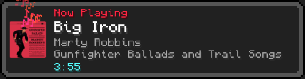

[](https://forthebadge.com)

# CiderToast 🎵

a minecraft-style "now playing" toast for windows. start a song and a lil minecraft
toast slides into the corner with the title, artist, album, length and album art,
and it colors itself to match the album. works with basically ANY player (cider,
spotify, firefox, zen, whatever) because it reads windows' own media info. no api
keys, no logins, no setup.



## what it does

- slides in a minecraft toast every time the song changes
- shows **title / artist / album / length** + pixelated album art
- **themes itself to the album art**, the gold "Now Playing" header and the floating
  note particles pull the album's main color
- plays the real minecraft toast slide in/out sounds
- **universal**, anything that shows up in the windows media popup works (cider,
  spotify, browsers, etc). no per-app setup
- tray icon + a little minecraft-styled settings window (corner, duration, scale,
  toggles, album-art color on/off)
- "start with windows" toggle

## grab it

**just wanna run it?** download the self-contained `.exe` from
[Releases](../../releases). no .NET install, no extra files, just double-click.
(first launch takes a sec while it unpacks, then it's instant. windows smartscreen
might pop up since it's unsigned, so hit More info then Run anyway.)

**wanna build it?** you need the [.NET 10 SDK](https://dotnet.microsoft.com/download).
also grab the assets (see below), then:

```
dotnet build -c Release
```

or make the standalone single-file exe:

```
dotnet publish -c Release -r win-x64 --self-contained true -p:PublishSingleFile=true -p:IncludeNativeLibrariesForSelfExtract=true -p:EnableCompressionInSingleFile=true
```

## assets (read this if you're building)

the minecraft textures + sounds aren't in this repo, they're Mojang's, not mine to
hand out. drop your own into `assets/` with these exact names (see
[`assets/README.md`](assets/README.md) for details):

| file | what it is |
|---|---|
| `Monocraft.ttf` | the font ([download, it's free/OFL](https://github.com/IdreesInc/Monocraft)) |
| `now_playing.png` | the toast panel background (160×32 minecraft toast) |
| `music_notes.png` | note sprite sheet (16×128, eight 16×16 frames) |
| `In.wav` / `Out.wav` | the toast slide in/out sounds |
| `icon.ico` | app/tray icon |

## how it works

it listens to the Windows **System Media Transport Controls** (SMTC), the same thing
that powers the little media popup on your keyboard's play/pause key. that's why it
works with everything and needs no token. built in **WPF / .NET 10**. the toast is a
borderless topmost window with a nine-sliced panel, the album color gets pulled by
grabbing the dominant vibrant hue from the thumbnail.

tweak stuff in `config.json` (or the settings window): `toastSeconds`, `marginLeft/Top`,
`borderScale`, `minWidth`, `showArtwork`, `colorAccent`, `corner`.

## license

[MIT](LICENSE) for my code. the minecraft assets you supply are Mojang's and covered
by their terms, not this license.
